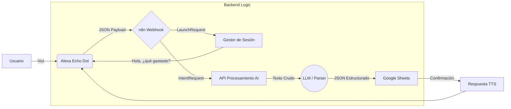

# 💰 Voice Finance Assistant (Alexa + n8n + AI)


Un sistema **Full-Stack de Voz** para el registro de gastos financieros. Este proyecto integra una Skill de Alexa personalizada con un backend de automatización (n8n) y procesamiento de lenguaje natural (AI) para estructurar gastos no estructurados y persistirlos en tiempo real.

---

## 🏗️ Arquitectura del Sistema

El sistema utiliza una arquitectura orientada a eventos donde Alexa actúa como el frontend de voz y n8n como el orquestador de backend.



### Flujo de Datos

1. **Input:** El usuario dicta una frase natural: *"Alexa, abre mi contador... compré una hamburguesa de 12 dólares"*.
2. **Transmisión:** Alexa convierte el audio a texto (STT) y envía un payload JSON vía HTTPS  al Webhook de n8n.
3. **Enrutamiento Inteligente:** n8n discrimina entre `LaunchRequest` (abrir la app) y `RegistrarGastoIntent` (procesar datos).
4. **Procesamiento (ETL):** La API personalizada (corriendo en Bun) recibe el texto desordenado, extrae entidades (`monto`, `moneda`, `categoría`) y normaliza los datos.
5. **Persistencia:** Los datos limpios se inyectan en Google Sheets como base de datos.
6. **Feedback:** Se genera una respuesta de texto (TTS) dinámica confirmando la transacción al usuario.

---

## 📂 Estructura del Repositorio

| Carpeta         | Descripción                                                                                                |
|-----------------|------------------------------------------------------------------------------------------------------------|
| `/api`          | **Microservicio de IA.** API construida con **Bun** y TypeScript encargada de limpiar y estructurar el texto natural del usuario. |
| `/n8n`          | **Lógica de Negocio.** Workflow JSON de n8n que maneja los webhooks, condicionales (If/Switch) y conexiones API.     |
| `/alexaSkill`   | **Frontend de Voz.** Modelo de interacción (Interaction Model) con los Intents, Slots (AMAZON.SearchQuery) y Utterances. |

---

## 🚀 Instalación y Despliegue

### Prerrequisitos

* **Bun:** Runtime de alto rendimiento para JavaScript/TypeScript.
* **n8n:** Servidor de automatización (Local o Cloud).


### 1. Configuración de la API (Backend)

Este proyecto utiliza **Bun** por su velocidad en tiempo de ejecución.

```powershell
# Ejecutar Microservicio
cd api
bun install
bun run dev
```

La API estará disponible en `http://localhost:3000` (o el puerto configurado).

### 2. Importación del Workflow (n8n)

1. Instalar e iniciar n8n.
2. Importar el archivo [finanzas_workflow.json](n8n/finanzas_workflow.json).
3. **Configuración de Seguridad:**

> ⚠️ **Importante:** El workflow exportado no contiene credenciales.

Tras importar, configura:
* **Google Sheets:** Credenciales OAuth2 o Service Account + Spreadsheet ID.
* **HTTP Request Nodes:** Actualiza las URLs para apuntar a tu instancia local de la API (`http://localhost:3000`).
* **Webhook:** Configura autenticación si es necesario.

### 3. Configuración de Alexa

1. Crear nueva Skill en [Alexa Developer Console](https://developer.amazon.com/alexa/console/ask).
2. Seleccionar "Custom Model" y "Provision your own".
3. En **JSON Editor**, pegar el contenido de [interaction_model.json](alexaSkill/interaction_model.json).
4. **Endpoint:** Configurar el endpoint HTTPS apuntado al webhook de n8n.
5. **SSL:** Seleccionar "My development endpoint is a sub-domain of a domain that has a wildcard certificate".
6. **Build Model:** Compilar el modelo y probar en la consola de prueba.

---