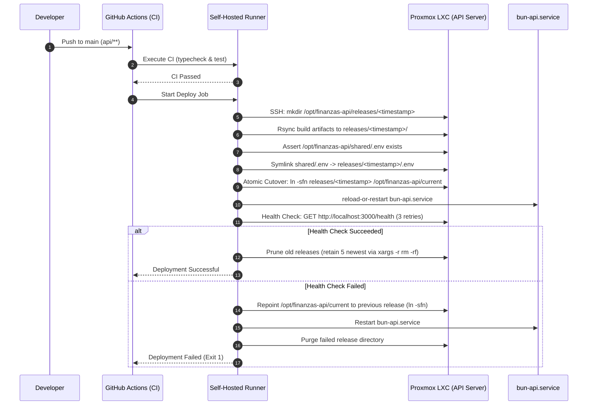

# Architecture — CI/CD Implementation

## System Overview

The CI/CD system connects two isolated LXC containers via SSH, using GitHub Actions as the orchestration layer.

```
┌─────────────────────────────────────────────────────────────────────────┐
│                              GitHub                                     │
│  ┌──────────────────┐                                                   │
│  │  Repository       │                                                   │
│  │  Finanzas_Personal│─── Push/PR (api/**) ───┐                        │
│  └──────────────────┘                          │                        │
└─────────────────────────────────────────────────┼────────────────────────┘
                                                  │
                                                  ▼
┌─────────────────────────────────────────────────────────────────────────┐
│                    LXC: Runner (Proxmox)                                │
│  ┌──────────────────────────────────────────────────────────────────┐  │
│  │  Self-Hosted Runner (github-runner user)                         │  │
│  │                                                                   │  │
│  │  Steps:                                                           │  │
│  │  1. Checkout repository                                          │  │
│  │  2. Setup Bun runtime                                            │  │
│  │  3. Install dependencies (bun install)                           │  │
│  │  4. Type checking (bunx tsc --noEmit)                            │  │
│  │  5. SSH connection to LXC API                                    │  │
│  └──────────────────────────────────────────────────────────────────┘  │
│                              │                                          │
│                              │ SSH (ed25519)                            │
└──────────────────────────────┼──────────────────────────────────────────┘
                               │
                               ▼
┌─────────────────────────────────────────────────────────────────────────┐
│                    LXC: API Server (Proxmox)                            │
│  ┌──────────────────────────────────────────────────────────────────┐  │
│  │  bun-api.service (systemd, root)                                  │  │
│  │                                                                   │  │
│  │  Working Directory: /opt/finanzas-api/current                     │  │
│  │  Port: 3000                                                       │  │
│  │  Runtime: Bun v1.3.5                                              │  │
│  │                                                                   │  │
│  │  Endpoints:                                                       │  │
│  │  - GET /health → { status: 'ok' }                                │  │
│  │  - POST /chat  → AI processing                                   │  │
│  └──────────────────────────────────────────────────────────────────┘  │
│                              │                                          │
│  ┌──────────────────────────────────────────────────────────────────┐  │
│  │  Pointer:  /opt/finanzas-api/current -> releases/<timestamp>      │  │
│  │  Releases: /opt/finanzas-api/releases/<timestamp>/ (max 5 kept)  │  │
│  │  Shared:   /opt/finanzas-api/shared/.env (persistent config)      │  │
│  └──────────────────────────────────────────────────────────────────┘  │
└─────────────────────────────────────────────────────────────────────────┘
```

## Component Responsibilities

### GitHub Actions

- **Trigger detection**: Path-based filtering (`api/**`)
- **CI validation**: Type checking, future tests
- **Orchestration**: Coordinate deploy steps
- **Secrets management**: Store SSH credentials

### Self-Hosted Runner

- **Code execution**: Run CI steps locally
- **SSH client**: Connect to API server
- **Deploy agent**: Transfer files, restart services
- **Health monitor**: Verify deployment success

### LXC API Server

- **Service hosting**: Run the Bun API via `/opt/finanzas-api/current`
- **Release management**: Maintain immutable releases under `/opt/finanzas-api/releases/`
- **Persistent config**: Maintain shared secrets at `/opt/finanzas-api/shared/.env`
- **Pointer cutover**: Atomic symlink switching via `ln -sfn`
- **Network exposure**: Serve API on port 3000

## Data Flow

### Push to Main (Deploy)

```
Developer → git push → GitHub → Actions → Runner → SSH → LXC API
                                                            │
                                              ┌─────────────┼─────────────┐
                                              │             │             │
                                              ▼             ▼             ▼
                                            Rsync        Symlink       Cutover
                                         (releases/)  (shared/.env)   (current)
                                                            │
                                                            ▼
                                                    Reload / Restart
                                                            │
                                                            ▼
                                                       Health Check
                                                            │
                                                  ┌──────────┴──────────┐
                                                  │                     │
                                                  ▼                     ▼
                                               Success               Rollback
                                            (Prune >5)         (Pointer Revert
                                                               & Purge Failed)
```

### Deployment Sequence Diagram



### Pull Request (CI Only)

```
Developer → git push → GitHub → Actions → Runner
                                              │
                                              ▼
                                    Type Checking + Tests
                                              │
                                      ┌───────┴───────┐
                                      │               │
                                      ▼               ▼
                                   Pass            Fail
                                      │               │
                                      ▼               ▼
                                   Allow          Block
                                   Merge           Merge
```

## Network Requirements

| Source | Destination | Port | Protocol | Purpose |
|--------|-------------|------|----------|---------|
| GitHub Actions | GitHub API | 443 | HTTPS | Workflow triggers |
| Runner LXC | GitHub | 443 | HTTPS | Checkout, artifacts |
| Runner LXC | API LXC | 22 | SSH | Deploy, manage |
| API LXC | Internet | 443 | HTTPS | AI provider APIs |
| Clients | API LXC | 3000 | HTTP | API access |

## Storage Layout

### LXC API Server

```
/opt/finanzas-api/
├── current -> releases/YYYYMMDD_HHMMSS/ # Active release symlink pointer
├── shared/
│   └── .env                             # Canonical environment configuration (chmod 0600)
└── releases/                            # Immutable release snapshots (retains 5 newest)
    ├── 20260914_140000/
    │   ├── .env -> /opt/finanzas-api/shared/.env
    │   ├── index.ts
    │   ├── package.json
    │   ├── bun.lock
    │   ├── services/
    │   └── ...
    └── 20260914_150000/
        └── ...
```

### LXC Runner

```
/home/github-runner/
├── .ssh/
│   ├── id_ed25519          # Private key
│   └── known_hosts         # API server fingerprint
└── _work/                  # GitHub Actions workspace
```

## Service Dependencies

### bun-api.service

```
Network Target
      │
      ▼
bun-api.service
      │
      ├── Depends on: network.target
      ├── User: root
      ├── WorkingDirectory: /opt/finanzas-api/current
      ├── ExecStart: /usr/local/bin/bun run index.ts
      └── EnvironmentFile: /opt/finanzas-api/current/.env
```

### External Dependencies

| Dependency | Purpose | Failure Impact |
|------------|---------|----------------|
| Groq API | AI processing | Fallback to next provider |
| Cerebras API | AI processing | Fallback to next provider |
| Gemini API | AI processing | Fallback to next provider |
| Mistral API | AI processing | Fallback to next provider |
| OpenRouter API | AI processing | Fallback to next provider |
| Internet | API calls | Complete failure |

## Failure Modes

| Failure | Detection | Response |
|---------|-----------|----------|
| Type check fails | CI job fails | Block merge, no deploy |
| SSH connection fails | Deploy job fails | No changes applied |
| Missing shared configuration (`shared/.env`) | Deploy step assertion fails | Abort deployment before restart, error logged |
| Rsync deploy fails | Deploy job fails | Abort deployment, pointer unchanged |
| Service reload/restart fails | Systemd error | Trigger automated rollback |
| Health check fails | Deploy job fails (3 retries) | Instant pointer rollback (`ln -sfn` to previous release), restart service, purge failed release dir |
| Rollback fails | Manual intervention | Alert operator, manual symlink inspection & restoration |

## Security Boundaries

```
┌─────────────────────────────────────────────────────────────┐
│                    Trust Boundaries                          │
│                                                              │
│  ┌──────────────┐    ┌──────────────┐    ┌──────────────┐  │
│  │   GitHub      │    │   Runner     │    │   API LXC    │  │
│  │              │    │              │    │              │  │
│  │  - Secrets   │───▶│  - SSH Key   │───▶│  - Service   │  │
│  │  - Workflows │    │  - Workspace │    │  - Files     │  │
│  └──────────────┘    └──────────────┘    └──────────────┘  │
│                                                              │
│  Isolation: Separate LXCs                                    │
│  Authentication: SSH ed25519                                 │
│  Authorization: sudoers (limited commands)                  │
└─────────────────────────────────────────────────────────────┘
```
