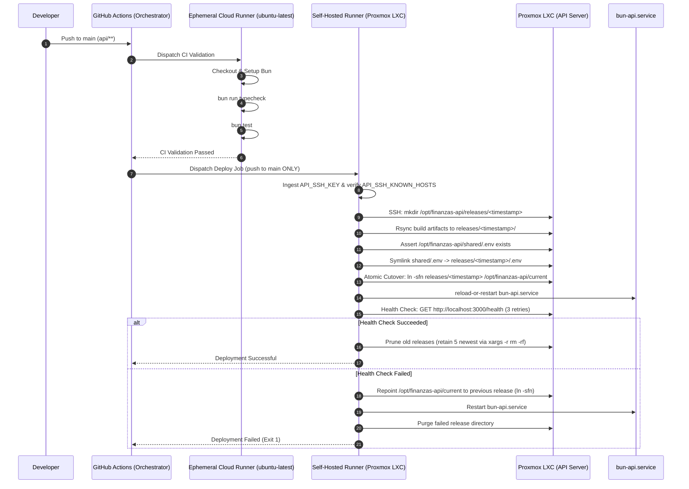

# Architecture — CI/CD Implementation

## System Overview

The CI/CD pipeline implements a hybrid security architecture operating across two trust domains:
1. **GitHub Cloud Infrastructure**: Ephemeral `ubuntu-latest` cloud runners execute continuous integration (CI) validation for all pull requests and pushes, completely sandboxing untrusted code from internal networks.
2. **On-Premises Proxmox VE Private Network**: Two isolated LXC containers connected via internal SSH handle continuous deployment (CD). A self-hosted runner executes deployments strictly on verified pushes to `main`.

```
┌──────────────────────────────────────────────────────────────────────────────────┐
│                            GitHub Cloud Infrastructure                           │
│  ┌──────────────────┐                                                            │
│  │  Repository       │─── PR / Push (api/**) ───┐                                 │
│  │  Finanzas_Personal│                          │                                 │
│  │  permissions:     │                          ▼                                 │
│  │    contents: read │        ┌───────────────────────────────────────────────┐   │
│  └──────────────────┘        │ Ephemeral Cloud Runner (ubuntu-latest)        │   │
│                              │  Steps:                                       │   │
│                              │  1. Checkout code (actions/checkout@v4)       │   │
│                              │  2. Setup Bun runtime (setup-bun@v2)          │   │
│                              │  3. Install dependencies (frozen-lockfile)    │   │
│                              │  4. Type checking (bun run typecheck)         │   │
│                              │  5. Unit tests (bun test)                     │   │
│                              │  * NO internal LAN access / NO deploy secrets │   │
│                              └───────────────────────┬───────────────────────┘   │
└──────────────────────────────────────────────────────┼───────────────────────────┘
                                                       │ CI Passed & Push to main
                                                       ▼
┌──────────────────────────────────────────────────────────────────────────────────┐
│                           Proxmox VE (Internal Private LAN)                      │
│  ┌────────────────────────────────────────────────────────────────────────────┐  │
│  │ LXC: Runner (self-hosted)                                                  │  │
│  │                                                                            │  │
│  │  Steps:                                                                    │  │
│  │  1. Checkout code (actions/checkout@v4)                                    │  │
│  │  2. Install production dependencies (bun install --production)            │  │
│  │  3. Configure SSH (~/.ssh/known_hosts via API_SSH_KNOWN_HOSTS secret)      │  │
│  │  4. Create timestamped release directory (/opt/finanzas-api/releases/...)   │  │
│  │  5. Rsync artifacts & link shared configuration (/opt/finanzas-api/shared) │  │
│  │  6. Atomic cutover (ln -sfn) & service reload (systemctl)                  │  │
│  │  7. Retry healthcheck (GET /health) & auto-rollback on failure             │  │
│  └─────────────────────────────────────┬──────────────────────────────────────┘  │
│                                        │                                         │
│                                        │ SSH (ed25519) + Host Verification       │
│                                        ▼                                         │
│  ┌────────────────────────────────────────────────────────────────────────────┐  │
│  │ LXC: API Server (bun-api.service)                                          │  │
│  │                                                                            │  │
│  │  Working Directory: /opt/finanzas-api/current -> releases/<timestamp>      │  │
│  │  Shared Config:     /opt/finanzas-api/shared/.env                          │  │
│  │  Service Target:    bun-api.service (Port 3000, internal only)             │  │
│  └────────────────────────────────────────────────────────────────────────────┘  │
└──────────────────────────────────────────────────────────────────────────────────┘
```

## Component Responsibilities

### GitHub Actions (Orchestrator)

- **Trigger detection**: Path-based filtering (`api/**`, `.github/workflows/api.yml`)
- **Least-privilege token**: Top-level `permissions: contents: read`
- **Job dependency gating**: `deploy` strictly depends on `ci` passing and `push` to `refs/heads/main`
- **Secrets management**: Store SSH credentials and host keys securely

### GitHub Cloud Runner (`ubuntu-latest`)

- **Untrusted code isolation**: Executes CI validation for PRs and push commits in an ephemeral cloud VM
- **Static verification**: Type checking (`bun run typecheck`)
- **Test execution**: Unit tests (`bun test`)
- **Network sandbox**: Completely isolated from internal homelab/Proxmox network; zero access to deploy secrets

### Self-Hosted Runner (Proxmox LXC)

- **Deploy agent**: Executes deployment exclusively on verified pushes to `main`
- **SSH client with host verification**: Ingests `API_SSH_KNOWN_HOSTS` or queries fingerprint via fallback
- **Release management**: Rsyncs artifacts, asserts shared environment, and performs atomic pointer cutover
- **Health monitoring & rollback**: Validates `GET /health` with retries; rolls back symlink instantly on failure

### LXC API Server (Proxmox LXC)

- **Service hosting**: Runs the Bun API via `/opt/finanzas-api/current`
- **Release management**: Maintains immutable releases under `/opt/finanzas-api/releases/` (5 kept)
- **Persistent config**: Maintains shared secrets at `/opt/finanzas-api/shared/.env` (chmod 0600)
- **Pointer cutover**: Atomic symlink switching via `ln -sfn`
- **Network exposure**: Serves API on port 3000 (restricted to internal traffic)

## Data Flow

### Push to Main (Deploy Flow)

```
Developer → git push → GitHub Actions (permissions: contents: read)
                          │
       ┌──────────────────┴──────────────────┐
       ▼                                     ▼
[CI: Cloud Runner (ubuntu-latest)]      [CD: Self-Hosted Runner (LXC)]
• Checkout (v4) & Setup Bun (v2)        (Gated on CI pass & push to main)
• bun install --frozen-lockfile         • SSH Key & Known Hosts verification
• bun run typecheck                     • Rsync to /opt/finanzas-api/releases/
• bun test                              • Symlink shared/.env & atomic cutover
• Ephemeral, NO LAN / NO secrets        • Systemctl reload-or-restart
                                        • Health check (GET /health) & rollback
```

### Deployment Sequence Diagram



### Pull Request (CI Only)

```
Developer → git push / PR → GitHub Actions → Cloud Runner (ubuntu-latest)
                                                │
                                                ▼
                                      Type Checking + Tests
                                                │
                                        ┌───────┴───────┐
                                        │               │
                                        ▼               ▼
                                     Pass            Fail
                                        │               │
                                        ▼               ▼
                                     Allow          Block
                                     Merge           Merge

* PRs never execute on the self-hosted runner and have zero access to the private network or secrets.
```

## Network Requirements

| Source | Destination | Port | Protocol | Purpose |
|--------|-------------|------|----------|---------|
| GitHub Actions | GitHub API | 443 | HTTPS | Workflow triggers |
| Runner LXC | GitHub | 443 | HTTPS | Checkout, artifacts |
| Runner LXC | API LXC | 22 | SSH | Deploy, manage |
| API LXC | Internet | 443 | HTTPS | AI provider APIs |
| Clients | API LXC | 3000 | HTTP | API access |

## Storage Layout

### LXC API Server

```
/opt/finanzas-api/
├── current -> releases/YYYYMMDD_HHMMSS/ # Active release symlink pointer
├── shared/
│   └── .env                             # Canonical environment configuration (chmod 0600)
└── releases/                            # Immutable release snapshots (retains 5 newest)
    ├── 20260914_140000/
    │   ├── .env -> /opt/finanzas-api/shared/.env
    │   ├── index.ts
    │   ├── package.json
    │   ├── bun.lock
    │   ├── services/
    │   └── ...
    └── 20260914_150000/
        └── ...
```

### LXC Runner

```
/home/github-runner/
├── .ssh/
│   ├── id_ed25519          # Private key
│   └── known_hosts         # API server fingerprint
└── _work/                  # GitHub Actions workspace
```

## Service Dependencies

### bun-api.service

```
Network Target
      │
      ▼
bun-api.service
      │
      ├── Depends on: network.target
      ├── User: root
      ├── WorkingDirectory: /opt/finanzas-api/current
      ├── ExecStart: /usr/local/bin/bun run index.ts
      └── EnvironmentFile: /opt/finanzas-api/current/.env
```

### External Dependencies

| Dependency | Purpose | Failure Impact |
|------------|---------|----------------|
| Groq API | AI processing | Fallback to next provider |
| Cerebras API | AI processing | Fallback to next provider |
| Gemini API | AI processing | Fallback to next provider |
| Mistral API | AI processing | Fallback to next provider |
| OpenRouter API | AI processing | Fallback to next provider |
| Internet | API calls | Complete failure |

## Failure Modes

| Failure | Detection | Response |
|---------|-----------|----------|
| Type check fails | CI job fails | Block merge, no deploy |
| SSH connection fails | Deploy job fails | No changes applied |
| Missing shared configuration (`shared/.env`) | Deploy step assertion fails | Abort deployment before restart, error logged |
| Rsync deploy fails | Deploy job fails | Abort deployment, pointer unchanged |
| Service reload/restart fails | Systemd error | Trigger automated rollback |
| Health check fails | Deploy job fails (3 retries) | Instant pointer rollback (`ln -sfn` to previous release), restart service, purge failed release dir |
| Rollback fails | Manual intervention | Alert operator, manual symlink inspection & restoration |

## Security Boundaries

```
┌──────────────────────────────────────────────────────────────────────────────────┐
│                             Trust & Isolation Boundaries                         │
│                                                                                  │
│   TIER 1: GITHUB CLOUD                          TIER 2: ON-PREM PRIVATE LAN      │
│  ┌───────────────────────┐                     ┌──────────────┐ ┌─────────────┐ │
│  │ Actions Orchestrator  │                     │ Runner LXC   │ │ API LXC     │ │
│  │ - secrets masking     │                     │ (self-hosted)│ │             │ │
│  │ - permissions: read   │                     │              │ │ bun-api     │ │
│  └───────────┬───────────┘                     │ - CD deploy  │ │ .env shared │ │
│              │                                 │   only       │ │ port 3000   │ │
│              ├───────────────────┐             │ - SSH key    │ │ internal    │ │
│              ▼                   ▼             │ - known_hosts│ │             │ │
│  ┌───────────────────────┐ ┌─────────────────┐ └──────┬───────┘ └──────▲──────┘ │
│  │ Ephemeral Runner      │ │ Push to main    │        │   SSH (22)     │        │
│  │ (ubuntu-latest)       │ │ Deploy Dispatch │        └────────────────┘        │
│  │ - Typecheck & Tests   │ └────────┬────────┘                                  │
│  │ - Sandboxed PR runs   │          │                                           │
│  │ - NO LAN reachability │          ▼                                           │
│  └───────────────────────┘   (Enters internal LAN on verified push only)        │
│                                                                                  │
│  Public PRs execute exclusively in Tier 1 Ephemeral Runners.                     │
│  Tier 2 On-Prem Runner is never reachable or invocable by untrusted fork PRs.    │
└──────────────────────────────────────────────────────────────────────────────────┘
```
