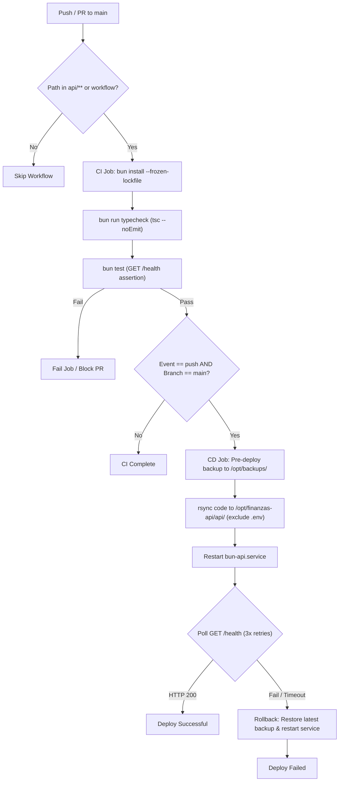

# Technical Design: API CI/CD Pipeline

## Technical Approach
Implement an automated CI/CD pipeline for the Bun TypeScript API (`api/`) using GitHub Actions on a self-hosted Proxmox LXC runner. The pipeline performs CI checks (TypeScript typechecking and Bun unit tests) on pull requests and pushes targeting `main`, path-filtered to `api/**` and `.github/workflows/api.yml`. Upon successful CI on `main`, the CD job initiates an atomic deployment: generates a timestamped snapshot under `/opt/backups/finanzas-api/`, synchronizes files via `rsync` while preserving `.env`, restarts `bun-api.service` via `systemctl`, and verifies `GET /health` with automatic backup restoration on failure.

## Architecture Decisions

| Option | Tradeoff | Decision |
|---|---|---|
| **Runner**: Self-hosted Proxmox LXC vs GitHub Cloud Runner | Self-hosted requires local host maintenance; cloud runners cannot reach private Proxmox LAN without tunnels. | **Self-hosted LXC**: Direct LAN connectivity to API LXC, zero egress cost, local caching. |
| **Deployment**: In-place rsync with backups vs Blue-Green / Containers | Containers or Blue-Green require surplus RAM and orchestration; in-place rsync has brief restart window (~100ms). | **In-place rsync + timestamped backups**: Minimal resource footprint for single LXC. |
| **Process Manager**: Systemd unit vs PM2 / supervisord | PM2 introduces Node.js runtime overhead; systemd is built into Linux OS. | **Systemd (`bun-api.service`)**: Native Linux process lifecycle, journald logging, and granular sudoers control. |
| **File Sync**: `rsync` over SSH vs Git checkout on target | Git on target requires credentials and stores repo history; rsync transfers only application files. | **`rsync` over SSH**: Copies cleanly, excludes `.git` and protects production `.env`. |

## Pipeline Flow

## File Changes

| File | Change Type | Purpose |
|---|---|---|
| `api/package.json` | Modified | Add `"typecheck": "tsc --noEmit"` and `"test": "bun test"` scripts. |
| `api/.env.example` | New | Environment template documenting runtime variables and AI provider keys. |
| `api/tests/health.test.ts` | New | Unit test asserting `GET /health` returns status 200 and `{ "status": "ok" }`. |
| `.github/workflows/api.yml` | New | GitHub Actions workflow defining CI validation and CD deployment with rollback. |
| `docs/cicd/*` | Tracked | Version-controlled operations guides and reference configs. |

## Interfaces & Contracts

- **NPM Scripts**:
  - `bun run typecheck`: runs `tsc --noEmit` via `api/tsconfig.json`.
  - `bun run test`: executes Bun test runner across `api/tests/*.test.ts`.
- **Health Check Contract**:
  - Endpoint: `GET http://localhost:3000/health`
  - Response: HTTP 200, Content-Type `application/json`, payload `{"status":"ok"}`.
- **Backup Directory**: `/opt/backups/finanzas-api/finanzas-api-<YYYYMMDD_HHMMSS>`

## Testing Strategy
- **Type Checking**: `bunx tsc --noEmit` enforces TypeScript static types without emission.
- **Unit Testing**: Bun test runner verifies `GET /health` response code and JSON body.
- **Post-Deploy Probe**: Probes `curl -s -o /dev/null -w '%{http_code}' --max-time 5 http://localhost:3000/health` up to 3 times with 2-second intervals.

## Threat Matrix

| Threat | Risk | Mitigation |
|---|---|---|
| **SSH Key Compromise** | Critical | Dedicated `ed25519` key; runner firewall restricted to LAN IP; strict file permissions (`600`/`700`). |
| **Command Injection in Deploy Script** | High | Static shell commands; avoid unescaped GitHub context expressions; quote all path variables. |
| **Rsync Path Traversal / Secret Overwrite** | High | Explicit target paths with trailing slashes; pass `--exclude='.env'` to protect production secrets. |
| **Sudoers Privilege Escalation** | High | Restrict `/etc/sudoers.d/github-runner` to exact binary paths without wildcards (`/usr/bin/systemctl restart bun-api`). |

## Migration & Rollout
1. **Local Setup**: Update `api/package.json`, add `api/.env.example` and `api/tests/health.test.ts`; verify `bun run typecheck` and `bun test`.
2. **Infra Provisioning**: Set up runner LXC, generate ed25519 SSH keys, install `bun-api.service`, create `/opt/backups/finanzas-api/`, configure sudoers, and set GitHub secrets (`API_SSH_*`).
3. **Pipeline Activation**: Commit `.github/workflows/api.yml` to trigger CI on PRs and automated CD on merges to `main`.

## Open Questions
- **Backup Retention**: Automate cleanup (pruning backups beyond the 5 most recent) via cron or post-deploy step.
- **Unprivileged Service User**: Migrate `bun-api.service` execution from root to dedicated `finanzas` user in future hardening.
