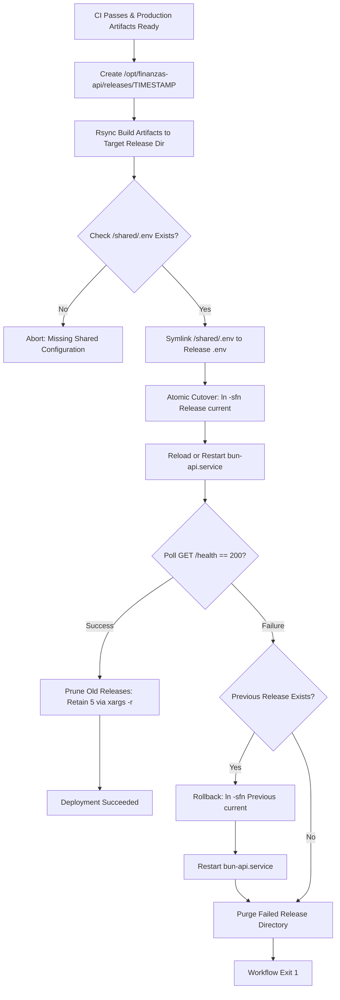

# Technical Design: API Symlink Deployment & Atomic Releases

## Technical Approach
The deployment pipeline transitions from in-place directory mutation to atomic symlink releases. Builds are rsynced to an immutable release folder (`/opt/finanzas-api/releases/<timestamp>`), linked to persistent configuration (`/opt/finanzas-api/shared/.env`), and cut over atomically using `ln -sfn` targeting `/opt/finanzas-api/current`. The systemd service runs with `WorkingDirectory=/opt/finanzas-api/current`. Post-cutover health verification triggers automatic retention pruning (retaining the 5 most recent releases) on success, or instantaneous pointer rollback and corrupt directory cleanup on failure.

## Architecture Decisions

| Option | Tradeoff | Decision |
|---|---|---|
| **Atomic Cutover**: `ln -sfn` vs `ln -sT` + `mv -T` | `ln -sfn` is standard across Linux/GNU coreutils and executes atomic replacement via `rename(2)`; temporary link swapping adds failure points. | Use `ln -sfn <target> /opt/finanzas-api/current` for zero-downtime atomic pointer switches. |
| **Secret Management**: Shared symlink vs per-release copy | File copying duplicates secrets across releases causing drift; symlinking guarantees a single source of truth. | Maintain `/opt/finanzas-api/shared/.env` and create a symbolic link inside each release. |
| **Rollback Strategy**: Pointer swap vs rsync restore | Rsync copying is slow and risks partial file states; pointer repointing is instantaneous (sub-millisecond). | Revert `/opt/finanzas-api/current` to previous release directory (`ls -dt ... | sed -n '2p'`). |
| **Retention Pruning**: Pipeline inline vs cron job | Cron decouples cleanup from deployment lifecycle; inline cleanup immediately frees disk space after verification. | Prune inline post-healthcheck via `ls -dt /opt/finanzas-api/releases/* \| tail -n +6 \| xargs -r rm -rf`. |
| **Service Execution**: Symlink path vs resolved target | Resolving physical path couples systemd to timestamp directories; symlink path decouples unit definition. | Configure systemd `WorkingDirectory=/opt/finanzas-api/current`. |

## Deployment Pipeline Flow



## File Changes

| File | Change Type | Description |
|---|---|---|
| `.github/workflows/api.yml` | Modified | Rsync to isolated release directory, symlink shared `.env`, atomic cutover, instant rollback, retention pruning. |
| `docs/cicd/ARCHITECTURE.md` | Modified | Document `/opt/finanzas-api/` layout (`releases/`, `shared/`, `current`) and symlink lifecycle. |
| `docs/cicd/CONFIGURATION.md` | Modified | Update `bun-api.service` (`WorkingDirectory=/opt/finanzas-api/current`), path settings, and sudoers rules. |
| `docs/cicd/OPERATIONS.md` | Modified | Update operational runbooks for manual deployment, instant symlink rollback, and maintenance. |
| `docs/cicd/TROUBLESHOOTING.md` | Modified | Add diagnostics for broken symlinks, cutover failures, dangling references, and pruning errors. |

## Interfaces & Contracts

### Server Directory Structure
- Application Root: `/opt/finanzas-api/`
- Active Symlink: `/opt/finanzas-api/current -> /opt/finanzas-api/releases/<timestamp>`
- Release Archive: `/opt/finanzas-api/releases/<YYYYMMDD_HHMMSS>/`
- Shared Config: `/opt/finanzas-api/shared/.env` (permissions `0600`)

### Systemd Unit (`/etc/systemd/system/bun-api.service`)
```ini
[Service]
WorkingDirectory=/opt/finanzas-api/current
ExecStart=/usr/local/bin/bun run index.ts
EnvironmentFile=/opt/finanzas-api/current/.env
```

### Script Execution Contracts
- **Link Shared Env**: `ln -sfn /opt/finanzas-api/shared/.env "${RELEASE_DIR}/.env"`
- **Atomic Cutover**: `ln -sfn "${RELEASE_DIR}" /opt/finanzas-api/current`
- **Retention Pruning**: `ls -dt /opt/finanzas-api/releases/* | tail -n +6 | xargs -r rm -rf`
- **Instant Rollback**: `PREV=$(ls -dt /opt/finanzas-api/releases/* | sed -n '2p'); ln -sfn "${PREV}" /opt/finanzas-api/current`

## Testing Strategy
- **Workflow Syntax**: Validate `.github/workflows/api.yml` using `actionlint` and GitHub Actions schema validation.
- **Rollback Simulation**: Deploy a faulty build (simulated startup crash), assert healthcheck fails after 3 attempts, confirm `/opt/finanzas-api/current` reverts to previous release, verify `bun-api.service` restarts healthy, and confirm the failed release directory is purged.
- **Retention & Safety Verification**:
  - Populate `/opt/finanzas-api/releases/` with 7 dummy timestamp folders, run the pruning pipeline, and assert exactly 5 newest folders remain.
  - Test edge case with $\le 5$ releases to verify `xargs -r` (`--no-run-if-empty`) prevents executing `rm -rf` without arguments.

## Threat Matrix

| Threat | Severity | Impact | Mitigation |
|---|---|---|---|
| **Symlink Race Condition** | Low | Broken file reads during cutover | `ln -sfn` executes atomic `rename(2)` syscall replacement under POSIX. |
| **Secret Exposure** | High | Leakage of database credentials and API keys | Enforce `chmod 600` and deploy-user ownership on `/opt/finanzas-api/shared/.env`. |
| **Command Injection** | High | Unauthorized shell execution during deployment | Strictly quote bash variables (`"${RELEASE_DIR}"`) and format timestamps with safe regex `^[0-9_]+$`. |
| **Privilege Escalation** | High | Unprivileged runner root takeover | Sudoers rules limited strictly to `systemctl reload-or-restart bun-api.service` and `systemctl restart bun-api.service`. |

## Migration / Rollout (4-Step Zero-Downtime Guide)
1. **Initialize Hierarchy**:
   `mkdir -p /opt/finanzas-api/releases /opt/finanzas-api/shared`
2. **Relocate Environment Configuration**:
   `mv /opt/finanzas-api/api/.env /opt/finanzas-api/shared/.env && chmod 600 /opt/finanzas-api/shared/.env`
3. **Establish Baseline Release & Symlink**:
   `mv /opt/finanzas-api/api /opt/finanzas-api/releases/initial && ln -sfn /opt/finanzas-api/releases/initial /opt/finanzas-api/current && ln -sfn /opt/finanzas-api/shared/.env /opt/finanzas-api/current/.env`
4. **Update Service & Cut Over**:
   `sed -i 's|WorkingDirectory=.*|WorkingDirectory=/opt/finanzas-api/current|' /etc/systemd/system/bun-api.service && systemctl daemon-reload && systemctl restart bun-api.service`

## Open Questions
- None. All requirements, permissions, and directory interfaces are defined.
